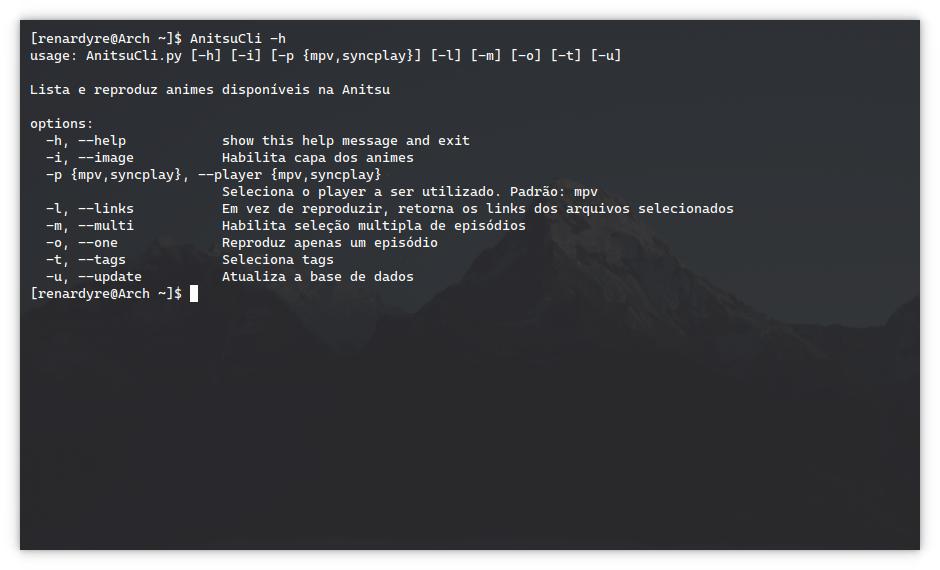

# AnitsuCli


### Third-Party Dependencies
- [fzf](https://github.com/junegunn/fzf)
- [imagemagick](https://github.com/ImageMagick/ImageMagick)
- [feh](https://github.com/derf/feh)
- [mpv](https://github.com/mpv-player/mpv)

### Create .env file:

```
USERNAME=""
PASSWD=""
ARIA_URL=""     #Optional 
ARIA_TOKEN=""   #Optional
```

### Install Requirements and Create the DataBase:

```bash
pip install -r requirements.txt
chmod +x run.sh
chmod +x *py
./run.sh
```

### Run AnitsuCli

```
./AnitsuCli.py --help
```


